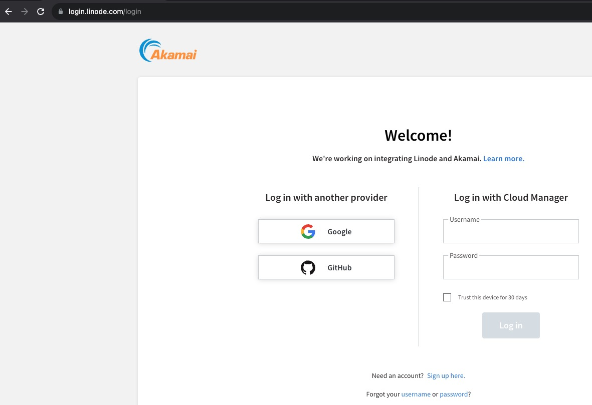
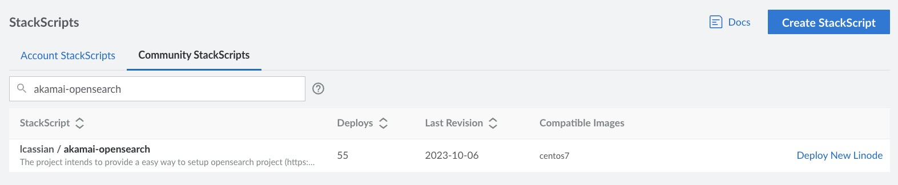
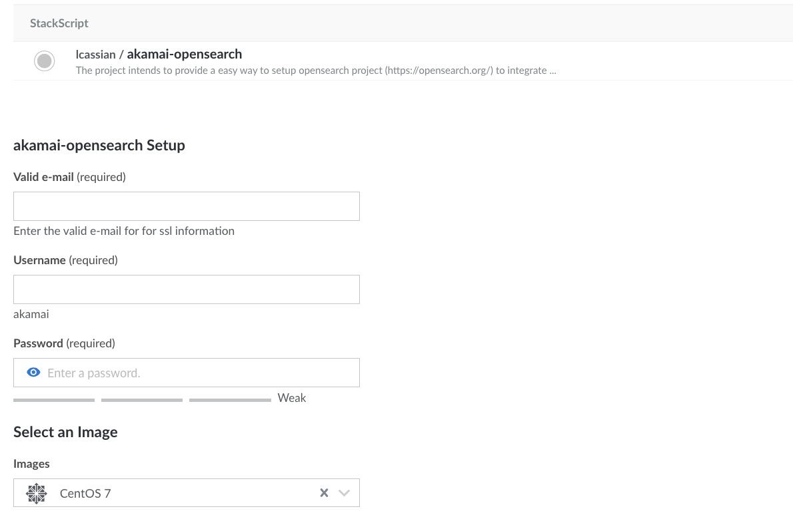
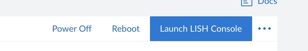
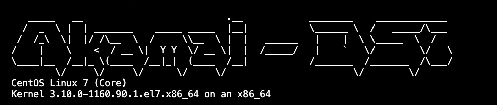
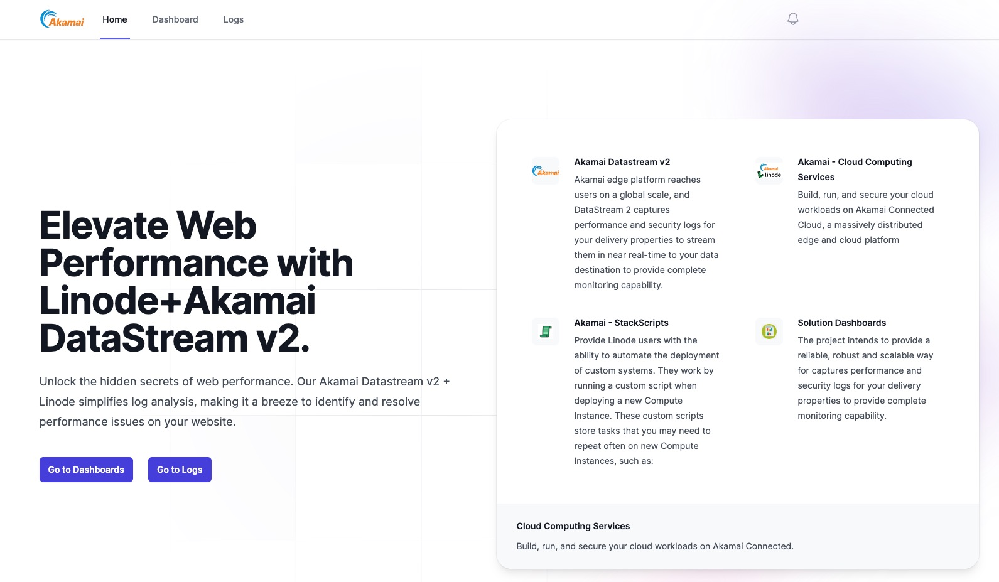

# Linode for Akamai Datastream v2

The project intends to provide a easy way to setup Dashboards in [Akamai Cloud Computing](https://www.linode.com/) to make more easy to integrate with Akamai products like SIEM integration and [Datastream v2](https://techdocs.akamai.com/datastream2/docs/welcome-datastream2).

1.  Linode.
    Build, run, and secure your cloud workloads on Akamai Connected Cloud, a massively distributed edge and cloud platform. [Sign up](https://login.linode.com/signup) today.

1.  Datastream v2.
    Akamai​'s edge platform reaches users on a global scale, and DataStream 2 captures performance and security logs for your delivery properties to stream them in near real-time to your data destination to provide complete monitoring capability. [Datastream v2](https://techdocs.akamai.com/datastream2/docs/welcome-datastream2).

## Prerequisites
Before you begin, you need to [Create your account](https://login.linode.com/signup) in [Akamai Cloud Computing](https://www.linode.com/).


## Install

1.  Make a [Login](https://login.linode.com/login) in [Akamai Cloud Computing](https://www.linode.com/) .
    
    

2. Search for [StackScript](https://cloud.linode.com/linodes/create?type=StackScripts&subtype=Account&stackScriptID=1200644), and click on Deploy

    

3. Provide basic information [StackScript](https://cloud.linode.com/linodes/create?type=StackScripts&subtype=Account&stackScriptID=1200644).

    

3. Use Lish to check the installation process and waiting for wellcome message

    # Lish access
    

    # Wellcome message
    

4. Use network tab to get hostname and access interface

    


    ```
    TBD
    ```

## Motivation

Customers want to use Openseach, analyze and process their Akamai Security Data, DataStream Data to build reports, dashboards or even to get insights in real-time to take actions in a fast manner.

## Maintainers

- [Leandro Cassiano](https://contacts.akamai.com/lcassian) - Solution Architect LATAM
- [Felipe Vilarinho](https://contacts.akamai.com/fvilarin) - Engagement Manager LATAM
- [Jonathan Goncalves Moreira](https://contacts.akamai.com/jgoncalv) - Engagement Manager LATAM
